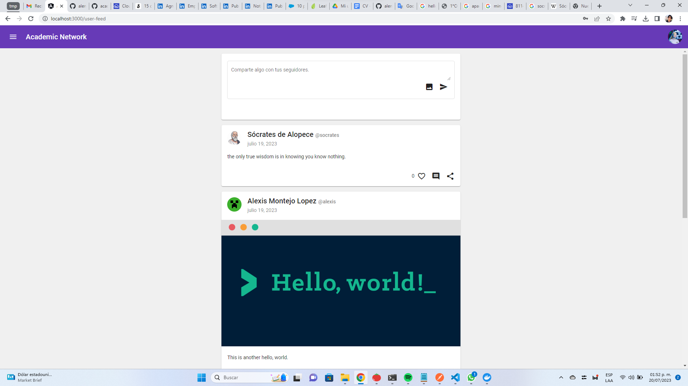
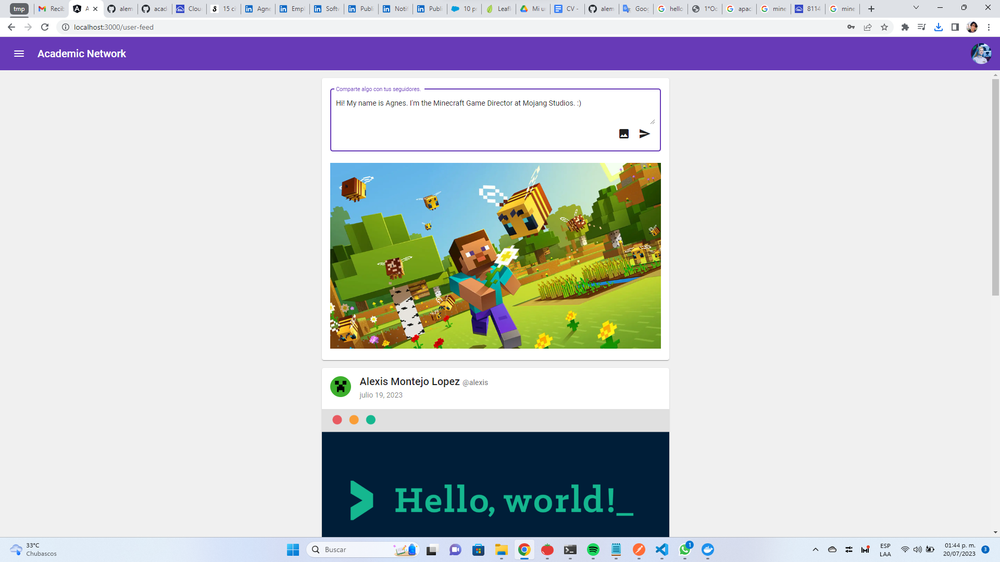
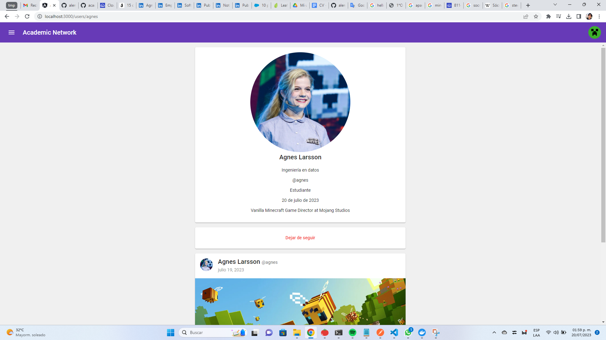
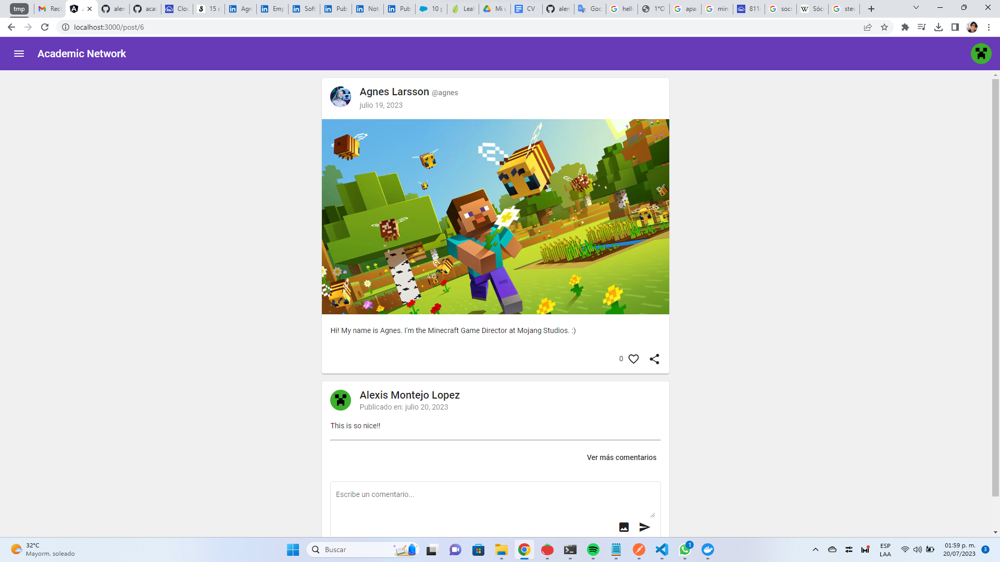
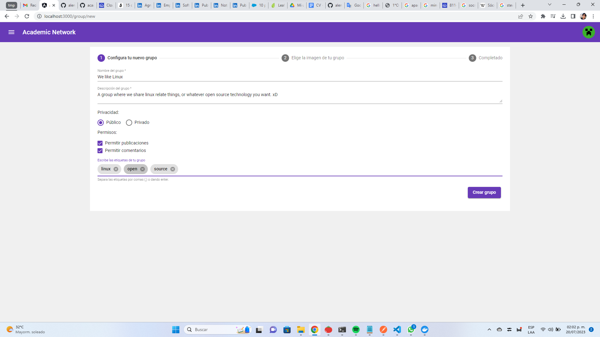
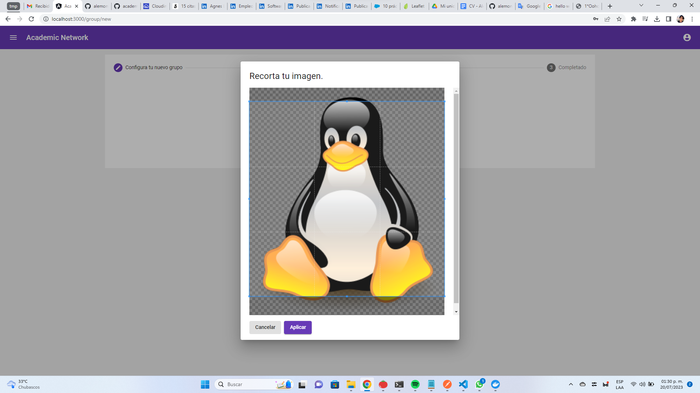
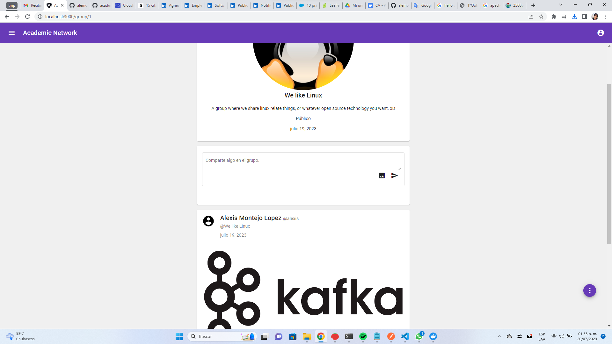
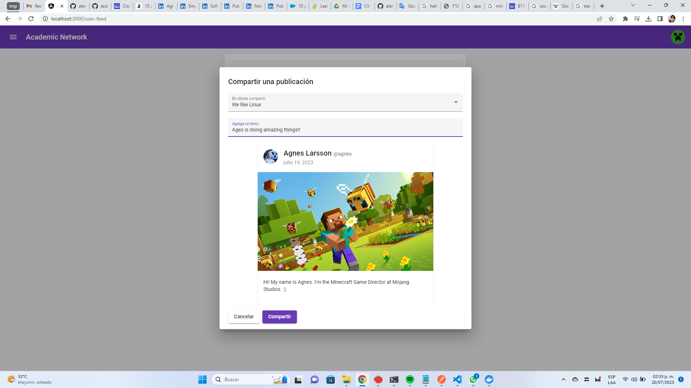
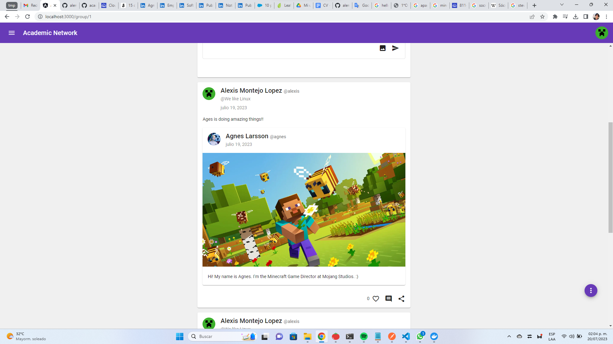
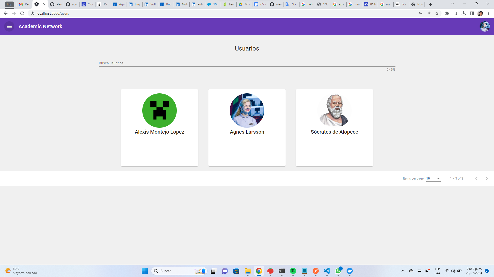

# Academic Network

An academic social network for members of a school to interact with each other.

This project was originally designed to deploy each component in a different machine,
but to make easier the deployment process, it was rearranged to work in a single machine
through Docker and Docker Compose.

## Authors

* Axel Alexis Montejo Lopez
  * [LinkedIn](https://www.linkedin.com/in/alemontejolp/)
  * [GitHub](https://github.com/alemontejolp)
* Angel Julian Maldonado Aguilar
  * [LinkedIn](https://www.linkedin.com/in/julianmaldonadoag/)
  * [GitHub](https://github.com/julianmaldonadoag)

## Deploy on a single machine

### Production

**For production**, you can create a `docker-compose.yml` file based on the template
`docker-compose.yml.example`. You have to fill the values indicated by the variables
in angles brackets.

Once done, execute `docker compose up`.

### Development

**For development**, in order to enable hot-reload, host volumes are created in the
directories `./platform-rest-api` and `./platform-webapp`, so no files are copied
from the host to the container. You must install the dependencies before start the
system. Setting to enable this behavior are provided in the `docker-compose.dev.yml.example`
file, so create a `docker-compose.dev.yml` based on the example and fill the values
indicated in the variables in angle brackets.

Once done, execute `docker compose -f docker-compose.dev.yml up`.

### Variables to fill

This is the list of variables you will have to fill. Make sure you are not
missing any, some variables can appear more than once.

* **\<your-super-secure-api-key>** : An API key for the webapp to be allowed of use the API REST service.
* **\<your-school-domain>** : The domain of your school. Only emails with this domain can sign up.
* **\<major-list>** : The list of majors of your school, separed by comma. Example: "Data Engineering,Environmantal Engineerin,Industrial Engineering" without quotation marks.
* **\<host-rest-api-port>** : The port on the host that maps to the port on the REST API container.
* **\<host-web-app-port>** : The port on the host that maps to the port on the webapp container.
* **\<host-db-port>** : The port on the host that maps to the port on the database container.
* **\<host-domain>** : The domain of your server.
* **\<db-root-passwd>** : The database root password.
* **\<db-user-name>** : User name of the database.
* **\<db-user-passwd>** : User password of the database.
* **\<db-name>** : Name of the database.
* **\<time-zone>** : Timezone to use in the database. Example: America/Cancun. See [the reference](https://en.wikipedia.org/wiki/List_of_tz_database_time_zones).
* **\<cloudinary-cloud-name>** : Your cloud name of [Cloudinary](https://cloudinary.com/). For image storage.
* **\<cloudinary-api-key>** : Your API key of [Cloudinary](https://cloudinary.com/). For image storage.
* **\<cloudinary-api-secret>** : Your API secret of [Cloudinary](https://cloudinary.com/). For image storage.

Available only in development.

* **\<install-dependencies-for-rest-api>** : A flag that indicates if dependencies must be installed on start up for the REST API. Any non-empty string is valid to set this option as true. It is just needed the first time you start the system in development mode.
* **\<install-dependencies-for-web-app>** : A flag that indicates if dependencies must be installed on start up for the Web app. Any non-empty string is valid to set this option as true. It is just needed the first time you start the system in development mode.

### Demo

Here is a **docker compose** file almost ready for you to try the application quickly.
Copy and paste it in a `docker-compose.yml` file and start the system with
`docker compose up`. Just fill the three variables related to [Cloudinary](https://cloudinary.com/).

To sign up, use email with domain of `gmail.com`.

Dont use this docker compose file for production since the sensitive data is publicy exposed.

``` yml
# docker-compose.yml
version: "3.9"
services:
  platform-rest-api:
    build:
      context: ./platform-rest-api
      dockerfile: ./Dockerfile
    ports:
      - "3001:3000"
    environment:
      # Required variables
      - MARIADB_HOST=platform-db
      - MARIADB_USER=app_backend
      - MARIADB_PASS=qwerty
      - MARIADB_DATABASE=academic_network
      - IANA_TIMEZONE=America/Cancun
      - MARIADB_PORT=3306 # As the connection happen inside the container, the correct port is one the exposed by the target container.
      - CLOUDINARY_CLOUD_NAME=<cloudinary-cloud-name>
      - CLOUDINARY_API_KEY=<cloudinary-api-key>
      - CLOUDINARY_API_SECRET=<cloudinary-api-secret>
      # Optionals but recommended for Docker initialization.
      - PLATFORM_WEBAPP_APIKEY=87d1a60af4c1a9a5142bee72a87f1edd1ee9638866a87f333ca9677390c0c16a
      - SCHOOL_DOMAIN=gmail.com
      - SCHOOL_MAJORS=Ingeniería en Datos,Ingeniería Ambiental,Ingeniería Industrial
    links:
      - platform-db
    depends_on:
      platform-db:
        condition: service_healthy
        restart: true
  platform-web-app:
    build:
      context: ./platform-webapp
      dockerfile: ./Dockerfile
      args:
        - PLATFORM_WEBAPP_APIKEY=87d1a60af4c1a9a5142bee72a87f1edd1ee9638866a87f333ca9677390c0c16a
        - REST_API_DOMAIN=http://localhost:3001 # As the connections happen outside the container, the correct port is the host's port not the one of the container. 
    ports:
      - "3000:3000"
    links:
      - platform-rest-api
  platform-db:
    image: mariadb:11.1-rc-jammy
    ports:
      - "3310:3306"
    environment:
      - MARIADB_ROOT_PASSWORD=wizard
      - MARIADB_USER=app_backend
      - MARIADB_PASSWORD=qwerty
      - MARIADB_DATABASE=academic_network
    healthcheck:
      test: echo "use academic_network;" | mariadb -u app_backend -pqwerty
      interval: 10s
      timeout: 10s
      retries: 5
      start_period: 40s
    volumes:
      - platform-data:/var/lib/mysql

volumes:
  platform-data:
```

## Images

Here are some images of the application.



















